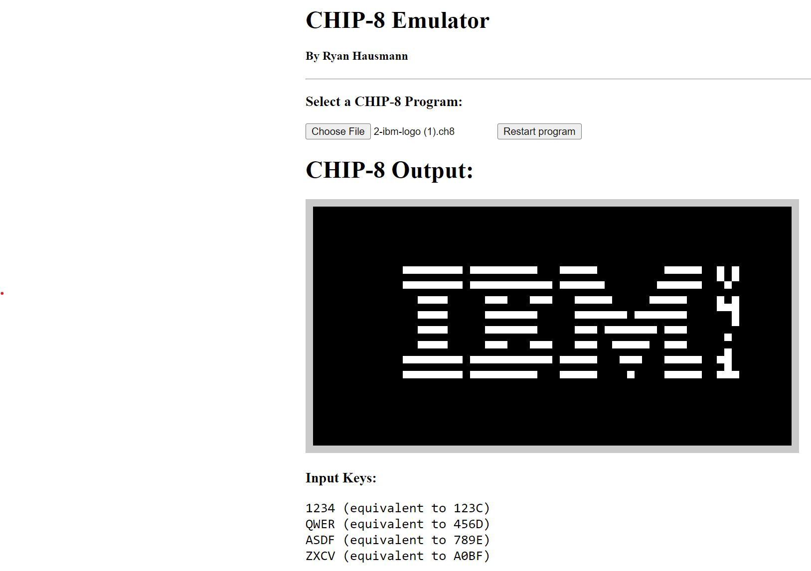

# CHIP-8 Emulator
### Written in Rust/JS using WASM
Build source with `wasm-pack build --target web`, then run a web server over the top directory (I used `python -m http.server`) and navigate to /web (for my case, this was `localhost:8000/web`).
## Demos
IBM Logo demo:

Pong game demo (video, click [here](demos/pong.mp4) to watch)